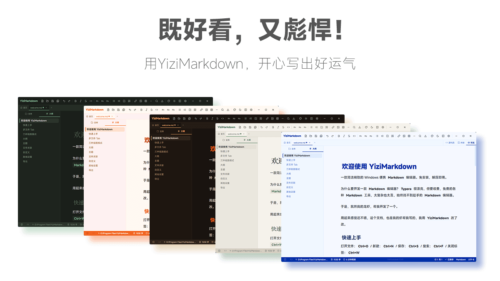

# YiziMarkdown

<p align="center">
  
</p>

一款简洁精致的 Windows 便携 `Markdown` 编辑器。免安装，解压即用。

为什么要开发一款 `Markdown` 编辑器？`Typora` 很漂亮，但要收费，免费的各种 `Markdown` 工具，太复杂也太丑，始终找不到趁手的 `Markdown` 编辑器。

于是，就然我的龙虾，帮我开发了一个。

用起来感觉还不错，这个文档，也是我的虾帮我写的，我用 `YiziMarkdown` 改了改。

---

## 功能特性

### 编辑与预览

- **源代码编辑**：CodeMirror 6 内核，语法高亮、括号匹配、自动补全
- **实时预览**：Markdown 即写即渲染，支持任务列表 checkbox 交互
- **三种视图模式**：源代码 / 并排 / 预览，一键切换
- **大纲驱动滚动同步**：并排模式下左右面板双向联动，切换视图时自动定位到当前位置
- **搜索替换**：支持匹配项导航、全部替换
- **工具栏快捷格式**：粗体、斜体、删除线、行内代码，选中文字即裹即用
- **本地图片渲染**：预览模式自动渲染本地路径图片（jpg/png/gif/webp/svg/bmp）
- **行号 / 自动换行**：均可在设置中开关

### 多文件管理

- **Tab 标签栏**：顶部管理多个打开的文件，切换、关闭、新建
- **首页**：最近打开的文件列表，含文件大小和修改时间
- **保存状态指示**：未保存文件呼吸圆点动画，保存后 ✅ 确认动画
- **关闭确认**：未保存文件关闭时弹出保存 / 不保存 / 取消确认

### 文件操作

- **打开**：支持 .md / .markdown / .txt
- **新建**：新建空白 Tab，显示「未命名新文件」
- **保存 / 自动保存**：手动保存 + 可配置间隔的自动保存（1~10 秒）
- **另存为**：新建文件保存时自动弹出另存为对话框
- **导出**：HTML / Markdown / 纯文本三种格式
- **.md 文件关联**：设置中一键设为系统默认 Markdown 编辑器，双击 .md 直接打开
- **命令行打开**：`YiziMarkdown.exe 文件路径.md` 直接打开

### 外观定制

- **六套主题**：学术蓝（默认）、活力橙、科技感、极简风、杂志感、自然风
- **深色 / 亮色模式**：每套主题均有亮暗两套配色
- **字体自定义**：源代码模式和预览模式分别设置字体、字号、行高
- **自定义 CSS**：`user.css` 覆盖在所有主题之后，优先级最高
- **主题扩展**：`themes/` 目录放入 `.css` 文件，重启后自动识别

### 其他

- **文档模板**：`templates/` 目录放入 `.md` 文件，新建时可选择
- **快捷键配置**：`keybindings.json` 自定义快捷键
- **设置面板**：通用、外观、编辑器、关于四个标签页，设置即时预览

---

## 快捷键

| 快捷键 | 功能 |
|--------|------|
| Ctrl+N | 新建文件 |
| Ctrl+O | 打开文件 |
| Ctrl+S | 保存（新建文件自动弹出另存为） |
| Ctrl+W | 关闭当前 Tab |
| Ctrl+F | 搜索 |
| Ctrl+B | 粗体 |
| Ctrl+I | 斜体 |
| F12 | 开发者工具 |

---

## 便携版目录结构

```
YiziMarkdown/
├── YiziMarkdown.exe        # 主程序
├── readme.md               # 项目说明（本文件）
├── welcome.md              # 欢迎文档
├── changelog.md            # 开发日志
├── user.css                # 用户自定义样式
├── keybindings.json        # 快捷键配置
├── themes/                 # 主题 CSS 文件
│   ├── academic.css        # 学术蓝（默认）
│   ├── vibrant.css         # 活力橙
│   ├── tech.css            # 科技感
│   ├── minimal.css         # 极简风
│   ├── magazine.css        # 杂志感
│   └── nature.css          # 自然风
└── templates/              # 文档模板
    └── default.md          # 默认模板
```

---

## 技术栈

| 层级 | 技术 |
|------|------|
| 桌面框架 | Tauri 2 (Rust) |
| 前端框架 | React 18 + TypeScript |
| 编辑器内核 | CodeMirror 6 |
| 状态管理 | Zustand (persist) |
| 样式方案 | Tailwind CSS + CSS 变量 |
| Markdown 渲染 | markdown-it |
| 构建工具 | Vite |

---

## 开发

### 环境要求

- Node.js 18+
- Rust (stable)
- Tauri CLI (`npm install -g @tauri-apps/cli`)

### 启动开发服务器

```bash
cd code
npm install
npm run tauri:dev
```

### 构建发布版

```bash
npm run tauri:build
```

构建产物：
- 便携版 exe：`src-tauri/target/release/yizimarkdown.exe`
- MSI 安装包：`src-tauri/target/release/bundle/msi/`
- NSIS 安装包：`src-tauri/target/release/bundle/nsis/`

构建后手动复制 exe 和资源文件到 `public/YiziMarkdown-vX.X.X/` 目录分发。

### 项目结构

```
code/
├── src/                    # 前端源码
│   ├── App.tsx             # 主应用组件
│   ├── components/         # UI 组件
│   │   ├── Editor.tsx      # CodeMirror 编辑器 + 预览
│   │   ├── TabBar.tsx      # Tab 标签栏
│   │   ├── HomePage.tsx    # 首页（最近文件）
│   │   ├── Toolbar.tsx     # 工具栏
│   │   ├── Sidebar.tsx     # 侧栏（大纲 + 文件浏览）
│   │   ├── StatusBar.tsx   # 底部状态栏
│   │   └── SettingsModal.tsx # 设置面板
│   ├── stores/             # Zustand 状态管理
│   ├── lib/                # 工具库（markdown 渲染、标题 ID）
│   └── styles/             # 全局样式
├── src-tauri/              # Rust 后端
│   ├── src/main.rs         # Tauri 命令（文件读写、主题加载、注册表等）
│   ├── icons/              # 应用图标
│   ├── themes/             # 主题 CSS
│   └── templates/          # 文档模板
└── package.json
```

---

## 许可

MIT
