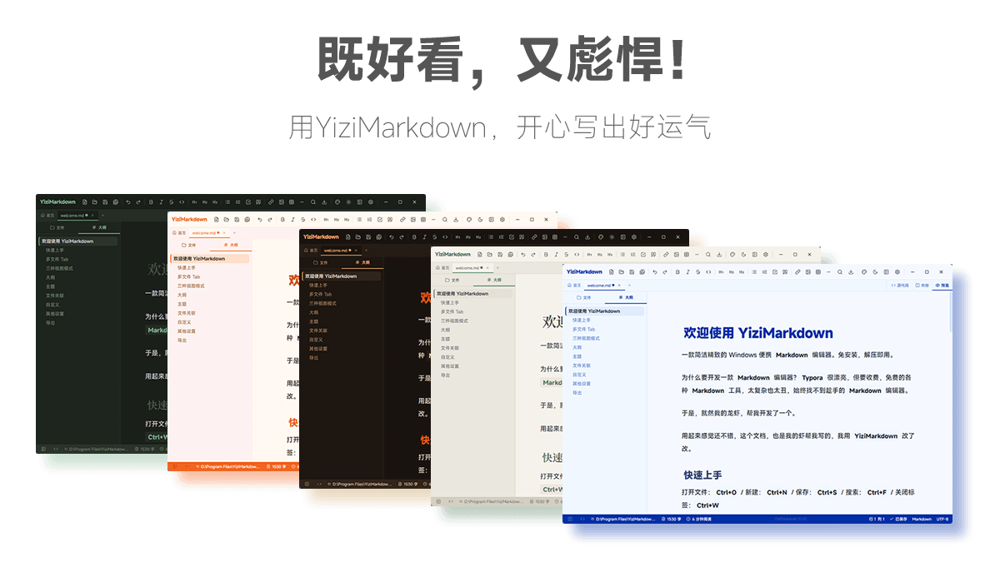

# YiziMarkdown

<p align="center">
    
</p>

**官方网站：** https://md.yizigpt.com

一款简洁精致的跨平台 `Markdown` 编辑器，支持 Windows 便携版与 macOS 版本。免安装，解压即用，兼顾颜值与实用。Windows 可安装，也可下载压缩包解压即用；macOS 提供通用二进制安装包，Intel 与 Apple Silicon 均原生运行。

为什么要开发一款 `Markdown` 编辑器？

市面上不少 `Markdown` 编辑器，要么界面观感欠佳，要么功能繁杂臃肿，很难找到一款兼顾简洁美观、上手顺手的编辑工具。

于是便有了 YiziMarkdown。

我们为所见即所得模式，创造了一种极为优雅的体验；同时支持类 PPT 快捷演示能力，写好的笔记文档可以快速切换演示模式，方便做分享汇报。试过才知道。

---

## 功能特性

### 多语言界面

- **15 种界面语言**：简体中文（默认）、繁體中文、English、日本語、한국어、Deutsch、Français、Español、Português、Italiano、Polski、Nederlands、Türkçe、Svenska、Українська
- 设置 → 通用 → 界面语言一键切换，即时生效；全部界面文案、快捷键面板、插件说明随语言联动

### AI 助手（侧边聊天面板）

- **17 家大模型供应商 + 自定义服务**：OpenAI、Anthropic、Gemini、xAI、Mistral、Groq、DeepSeek、通义千问、智谱 GLM、Moonshot Kimi、火山方舟、硅基流动、MiniMax、OpenRouter、OpenCode Go、Ollama（本地）；「自定义服务」支持 OpenAI 兼容 / Anthropic 兼容两种协议，自填 Base URL、模型 ID 与密钥，可接任意第三方服务
- **AI 技能（Skill）**：输入框 ⚡ 按钮弹出技能菜单，选中后技能 tag 插入光标处，提示词自动注入上下文；`skills/` 目录放入 `skills.json` + `.md` 提示词即可自定义技能。内置「演示稿提炼」「文档摘要」「润色改写」3 个技能
- **流式对话**：工具栏机器人按钮打开右侧 AI 面板，回复实时流式输出，可随时停止
- **思考过程展示**：推理模型的思考内容（reasoning/thinking）以可折叠区块展示，默认收起，不影响正文阅读
- **密钥安全**：API 密钥存系统钥匙串（OS keychain），支持一键保存、清除、验证；本地端点（llama.cpp / LM Studio / vLLM 等）密钥可留空
- **引用当前文档**：勾选后把当前文档作为上下文发送给 AI，可配置引用上限（64K~512K/不限）和上下文轮数（0~20轮，默认3轮）
- **结果落盘**：回复可复制、插入到文档光标处、或一键创建为新文档

### 编辑与预览

- **源代码编辑**：CodeMirror 6 内核，语法高亮、括号匹配、自动补全
- **实时模式（WYSIWYG）**：所见即所得编辑，输入时自动隐藏 Markdown 标记，专注内容创作
- **实时模式动画**：4种标记显现动画方案（聚焦/闪光/辉光/涟漪），设置中可预览切换
- **实时预览**：Markdown 即写即渲染，支持任务列表 checkbox 交互
- **五种视图模式**：源码 / 并排 / 实时（所见即所得） / 预览 / 演示（全屏幻灯片），一键切换
- **大纲驱动滚动同步**：并排模式下左右面板双向联动，切换视图时自动定位到当前位置
- **搜索替换**：支持匹配项导航、全部替换
- **工具栏快捷格式**：粗体、斜体、删除线、行内代码，选中文字即裹即用
- **本地图片渲染**：预览模式自动渲染本地路径图片（jpg/png/gif/webp/svg/bmp）
- **行号 / 自动换行**：均可在设置中开关
- **代码块增强**：语法高亮（highlight.js）、语言标签、复制按钮、自动换行切换
- **格式工具栏折叠**：窗口宽度不足时自动折叠，支持手动展开/收起
- **Frontmatter 过滤**：预览/并排/实时模式自动过滤 YAML frontmatter

### 数学公式与图表

- **KaTeX 公式**：内置 KaTeX 插件，行内 `$...$` 和块级 `$$...$$` LaTeX 公式实时渲染
- **Mermaid 图表**：内置 Mermaid 插件，流程图、时序图、甘特图、类图、饼图等自动渲染为可视化图表，支持多种主题配置
- **表格行列选择器**：工具栏表格按钮打开 8×8 网格，鼠标点选即插入对应行列数的表格

### 演示模式（幻灯片）

- **纯 Markdown 驱动**：不需要任何额外格式，`---`（水平分割线）分页，引擎分析整页结构自动选择版式
- **14 种自动版式**：封面、章节页、结尾页、目录、内容、列表、数据表、路线图、图文、图片、金句、代码、图表（mermaid）、公式
- **内容页左对齐 + 强调下划线**：标题左上对齐带主题色下划线，正文左对齐，阅读舒适
- **金句页对角大引号**：上引号挂左上角、下引号挂右下角，内容上下居中
- **显式指令**：`<!-- layout: xxx -->` 强制版式、`<!-- align: left|center|right -->` 整页对齐（HTML 注释，渲染不可见）
- **封面 meta**：front matter 提供 `author`/`date`，封面自动显示
- **页脚与进度**：左下角章节名 + 页码，底部主题色进度条
- **鼠标滚轮翻页**：内容可滚动时先滚内容，到边界再翻页
- **主题继承**：标题颜色随主题精确变化（15 个主题均支持），演示内可切换主题/明暗
- **全屏切换**：F 键全屏/还原，支持从任意窗口状态（普通/最大化）可靠进入
- **退出按钮**：鼠标活动时右上角显示半透明退出按钮，1.5 秒无操作自动隐藏
- **窗口状态还原**：退出演示时自动还原到进入前的窗口状态（全屏/最大化/普通）
- **演讲者备注**：`<!-- notes: ... -->` 注释，播放时按 `S` 显示

### 插件系统

- 插件化架构，内置 KaTeX 和 Mermaid 两个核心插件
- 设置面板「插件」页支持启停控制和插件配置
- 插件按需动态加载，未启用不占用资源

### 多文件管理

- **单实例模式**：多文件打开不再启动多个窗口，自动合并到已有实例，重复打开的文件自动定位到对应标签页
- **Tab 标签栏**：顶部管理多个打开的文件，切换、关闭、新建
- **首页**：最近打开的文件列表，含文件大小和修改时间
- **保存状态指示**：未保存文件呼吸圆点动画，保存后 ✅ 确认动画
- **关闭确认**：未保存文件关闭时弹出保存 / 不保存 / 取消确认

### 文件操作

- **打开**：支持 .md / .markdown / .txt
- **新建**：新建空白 Tab，显示「未命名新文件」
- **从模板新建**：工具栏「从模板新建」下拉菜单，按所选模板的 Markdown 结构创建新文档；也可在 设置 → 通用 设定默认模板，之后 `Ctrl+N` 自动套用
- **保存 / 自动保存**：手动保存 + 可配置间隔的自动保存（5~180 秒，默认 60 秒）
- **另存为**：新建文件保存时自动弹出另存为对话框
- **导出**：HTML / Markdown / 纯文本三种格式
- **.md 文件关联**：设置中一键设为系统默认 Markdown 编辑器，双击 .md 直接打开（Windows 注册表 / macOS LaunchServices）
- **命令行打开**：`YiziMarkdown 文件路径.md` 直接打开

### 外观定制

- **十五套内置主题**：学术蓝（默认）、活力橙、科技感、极简风、杂志感、自然风、液态玻璃、荔枝红、紫罗兰、赛博朋克、Facebook、黑客帝国、薄荷冰沙、落日熔金、复古打字机，每套均有亮暗两套配色
- **深色 / 亮色模式**：每套主题均有亮暗两套配色
- **字体自定义**：源码和预览模式分别设置字体、字号、行高
- **自定义 CSS**：`user.css` 覆盖在所有主题之后，优先级最高
- **主题扩展**：`themes/` 目录放入 `.css` 文件，重启后自动识别

### 其他

- **文档模板**：`templates/` 目录放入 `.md` 文件，新建时可选择
- **快捷键系统**：可视化快捷键配置面板，支持 30 个 action 的自定义绑定、按键录制、冲突检测和恢复默认
- **设置面板**：通用、外观、编辑器、实时模式、AI、插件、快捷键、模板、关于等多个标签页，设置即时预览

---

## 快捷键

| 快捷键 | 功能 |
|--------|------|
| Ctrl+N | 新建文件 |
| Ctrl+O | 打开文件 |
| Ctrl+S | 保存文件 |
| Ctrl+Shift+S | 另存为 |
| Ctrl+W | 关闭标签 |
| Ctrl+H | 导出 HTML |
| Ctrl+M | 导出 Markdown |
| Ctrl+Z | 撤销 |
| Ctrl+Y | 重做 |
| Ctrl+F | 搜索 |
| Ctrl+\ | 切换侧边栏 |
| Ctrl+B | 粗体 |
| Ctrl+I | 斜体 |
| Ctrl+- | 删除线 |
| Ctrl++ | 行内代码 |
| Ctrl+1 | 一级标题 |
| Ctrl+2 | 二级标题 |
| Ctrl+3 | 三级标题 |
| Ctrl+. | 无序列表 |
| Ctrl+0 | 有序列表 |
| Ctrl+' | 引用 |
| Ctrl+K | 链接 |
| Ctrl+` | 代码块 |
| Ctrl+T | 表格 |
| Ctrl+L | 分割线 |
| F1 | 快捷键大全 |
| F2 | 切换深浅模式 |
| F3 | 循环切换视图 |
| Ctrl+Alt+P | 演示模式（幻灯片） |
| Ins | 斜杠菜单 |
| F12 | 开发者工具 |

快捷键可在 设置 → 快捷键 中自定义，支持可视化配置和冲突检测。

---

## 便携版目录结构

```
YiziMarkdown/
├── YiziMarkdown.exe        # 主程序
├── readme.md               # 项目说明（本文件）
├── welcome.md              # 欢迎文档
├── changelog.md            # 开发日志
├── user.css                # 用户自定义样式
├── keybindings.json        # 快捷键配置
├── themes/                 # 主题 CSS 文件
│   ├── academic.css        # 学术蓝（默认）
│   ├── vibrant.css         # 活力橙
│   ├── tech.css            # 科技感
│   ├── minimal.css         # 极简风
│   ├── magazine.css        # 杂志感
│   ├── nature.css          # 自然风
│   ├── liquidglass.css     # 液态玻璃
│   ├── lychee.css          # 荔枝红
│   ├── violet.css          # 紫罗兰
│   ├── cyberpunk.css       # 赛博朋克
│   ├── facebook.css        # Facebook
│   ├── matrix.css          # 黑客帝国
│   ├── mint.css            # 薄荷冰沙
│   ├── sunset.css          # 落日熔金
│   └── typewriter.css      # 复古打字机
├── skills/                 # AI 技能（Skill）
│   ├── skills.json         # 技能清单
│   ├── slides-outline.md   # 演示稿提炼
│   ├── doc-summary.md      # 文档摘要
│   └── polish-writing.md   # 润色改写
└── templates/              # 文档模板
    └── default.md          # 默认模板
```

---

## 技术栈

| 层级 | 技术 |
|------|------|
| 桌面框架 | Tauri 2 (Rust) |
| 前端框架 | React 18 + TypeScript |
| 编辑器内核 | CodeMirror 6 |
| 状态管理 | Zustand (persist) |
| 样式方案 | Tailwind CSS + CSS 变量 |
| Markdown 渲染 | markdown-it |
| 国际化 | 自研轻量 i18n（15 语言） |
| AI 接入 | Rust 流式代理（OpenAI/Anthropic/Ollama 协议） |
| 构建工具 | Vite |

---

## 开发

### 环境要求

- Node.js 18+
- Rust (stable)
- Tauri CLI (`npm install -g @tauri-apps/cli`)

### 启动开发服务器

```bash
cd code
npm install
npm run tauri:dev
```

### 构建发布版

**Windows**

```bash
npm run tauri:build
```

构建产物：
- 便携版 exe：`src-tauri/target/release/yizimarkdown.exe`
- MSI 安装包：`src-tauri/target/release/bundle/msi/`
- NSIS 安装包：`src-tauri/target/release/bundle/nsis/`

构建后手动复制 exe 和资源文件到 `public/YiziMarkdown-vX.X.X/` 目录分发。

**macOS（通用二进制，同时支持 Intel 与 Apple Silicon）**

```bash
rustup target add aarch64-apple-darwin
npm run tauri:build -- --target universal-apple-darwin
```

构建产物：
- 应用包：`src-tauri/target/universal-apple-darwin/release/bundle/macos/YiziMarkdown.app`
- 安装包：`src-tauri/target/universal-apple-darwin/release/bundle/dmg/YiziMarkdown_0.2.2_universal.dmg`

### 项目结构

```
code/
├── src/                    # 前端源码
│   ├── App.tsx             # 主应用组件
│   ├── components/         # UI 组件
│   │   ├── Editor.tsx      # CodeMirror 编辑器 + 预览
│   │   ├── TabBar.tsx      # Tab 标签栏
│   │   ├── HomePage.tsx    # 首页（最近文件）
│   │   ├── Toolbar.tsx     # 工具栏
│   │   ├── Sidebar.tsx     # 侧栏（大纲 + 文件浏览）
│   │   ├── StatusBar.tsx   # 底部状态栏
│   │   └── SettingsModal.tsx # 设置面板
│   ├── stores/             # Zustand 状态管理
│   ├── lib/                # 工具库（markdown 渲染、标题 ID）
│   └── styles/             # 全局样式
├── src-tauri/              # Rust 后端
│   ├── src/main.rs         # Tauri 命令（文件读写、主题加载、注册表等）
│   ├── icons/              # 应用图标
│   ├── themes/             # 主题 CSS
│   └── templates/          # 文档模板
└── package.json
```

---

## 许可

MIT
