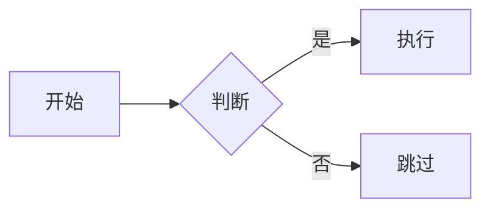

# YiziMarkdown 使用帮助

## 快速上手

YiziMarkdown 是一款简洁精致的 Windows 便携 Markdown 编辑器。解压即可使用，无需安装。

首次启动会自动打开欢迎文档。点击「新建」开始写作，或按 Ctrl+O 打开已有文件。

---

## 基本操作

### 新建文件

- 按 Ctrl+N 新建空白文件
- 标签栏右侧点击 + 号也可新建

### 打开文件

- 按 Ctrl+O，支持 .md / .markdown / .txt 格式
- 命令行打开：`YiziMarkdown.exe 文件路径.md`
- 双击 .md 文件（需先在设置中关联）

### 保存文件

- Ctrl+S 保存当前文件
- 新建文件首次保存时会自动弹出「另存为」对话框
- 可开启自动保存，间隔 1~10 秒

### 关闭文件

- 按 Ctrl+W 关闭当前标签
- 点击标签上的关闭按钮
- 未保存的文件关闭时会弹出确认对话框

### 导出

工具栏右侧导出按钮，支持三种格式：
- HTML（保留样式）
- Markdown（纯文本）
- 纯文本（去除所有格式）

---

## 编辑功能

### 视图模式

工具栏右侧或标签栏右侧可切换四种模式：

- **源代码模式**：纯 Markdown 文本编辑
- **实时模式**：所见即所得编辑，Markdown 标记自动隐藏，专注内容创作
- **并排模式**：左侧编辑，右侧实时预览，支持大纲联动滚动
- **预览模式**：纯渲染预览，不可编辑

切换视图时自动定位到当前编辑位置。

### 实时模式动画

实时模式下，Markdown 标记（如 `#`、`**`、`-` 等）会在光标进入时平滑显现，离开时自动隐藏。提供四种动画效果可选：

| 方案 | 效果 |
|------|------|
| 聚焦（默认） | 文字模糊后重新对焦 |
| 闪光 | 文字闪过一束光 |
| 辉光 | 模糊 + 闪光叠加 |
| 涟漪 | 多波峰衰减，如水面波纹 |

设置路径：设置 → 实时模式，可实时预览各方案效果。

### 工具栏格式化

工具栏提供常用格式按钮，选中文字后点击即可应用：

| 按钮 | 功能 | 快捷键 |
|------|------|--------|
| **粗体** | 加粗选中文字 | Ctrl+B |
| *斜体* | 斜体选中文字 | Ctrl+I |
| ~~删除线~~ | 添加删除线 | Ctrl+- |
| `行内代码` | 包裹为行内代码 | Ctrl++ |
| # 标题 | 在行首添加标题标记 | Ctrl+1/2/3 |
| - 列表 | 在行首添加列表标记 | Ctrl+. / Ctrl+0 |
| > 引用 | 在行首添加引用标记 | Ctrl+' |
| 链接 | 包裹为链接语法 | Ctrl+K |
| 图片 | 包裹为图片语法 | — |
| 代码块 | 插入代码块模板 | Ctrl+` |
| 分割线 | 插入水平分割线 | Ctrl+L |
| Σ 公式 | 选中文字包裹 `$` 行内公式 | — |
| 图表 | 插入 Mermaid 图表代码块 | — |
| 表格 | 打开 8×8 网格，点选插入对应行列数的表格 | Ctrl+T |

选中文字时，粗体、斜体、删除线、行内代码会自动包裹选中内容；标题、列表、引用会在选中行前添加前缀；链接和图片会将选中文字填入显示文本。

表格按钮打开一个 8 行 × 8 列的网格下拉面板，鼠标移到对应位置点击即可插入表格，无需手动输入分隔线和单元格。

选中文字时，粗体、斜体、删除线、行内代码会自动包裹选中内容；标题、列表、引用会在选中行前添加前缀；链接和图片会将选中文字填入显示文本。

### 斜杠菜单

输入 `/` 即可唤出斜杠菜单，快速插入 Markdown 标记（标题、列表、引用、代码块、表格等）。也可通过快捷键 Ins 触发。菜单支持键盘上下选择，按 Enter 插入。

### 搜索替换

按 Ctrl+F 打开搜索栏：
- 输入关键词高亮匹配
- 点击箭头逐个跳转匹配项
- 输入替换内容后点击「全部替换」

### 大纲导航

侧栏自动生成文档大纲（基于标题层级）：
- 点击大纲标题跳转到对应位置
- 并排模式下大纲与预览双向联动滚动

### 自动补全

编辑器支持 Markdown 语法自动补全：
- 输入 `#` 后按空格，自动生成标题
- 输入 `-` 或 `*` 后按空格，自动生成列表项
- 输入 `>` 后按空格，自动生成引用块
- 输入 `` ` `` 自动配对
- 输入 `**`、`*`、`~~`、`[` 等自动配对关闭

---

---

## 数学公式

内置 KaTeX 公式插件，支持 LaTeX 公式渲染：

- **行内公式**：在文本中用 `$...$` 包裹，如 `$E=mc^2$`，会渲染为行内数学符号
- **块级公式**：用 `$$...$$` 獬占一行，自动居中渲染为独立公式块

工具栏的 Σ 按钮可快速将选中文字包裹为行内公式。在 设置 → 插件 中可开关 KaTeX 插件。

---

## Mermaid 图表

内置 Mermaid 图表插件，用代码描述即可生成流程图、时序图、甘特图等：



支持的图表类型：流程图（graph/flowchart）、时序图（sequenceDiagram）、甘特图（gantt）、类图（classDiagram）、饼图（pie）、状态图（stateDiagram）等。

工具栏的图表按钮可快速插入 Mermaid 代码块模板。图表主题可在 设置 → 插件 → Mermaid 配置中切换（默认/深色/森林/中性）。

---## 快捷键

| 快捷键 | 功能 |
|--------|------|
| Ctrl+N | 新建文件 |
| Ctrl+O | 打开文件 |
| Ctrl+S | 保存文件 |
| Ctrl+Shift+S | 另存为 |
| Ctrl+W | 关闭标签 |
| Ctrl+H | 导出 HTML |
| Ctrl+M | 导出 Markdown |
| Ctrl+Z | 撤销 |
| Ctrl+Y | 重做 |
| Ctrl+F | 搜索 |
| Ctrl+\ | 切换侧边栏 |
| Ctrl+B | 粗体 |
| Ctrl+I | 斜体 |
| Ctrl+- | 删除线 |
| Ctrl++ | 行内代码 |
| Ctrl+1 | 一级标题 |
| Ctrl+2 | 二级标题 |
| Ctrl+3 | 三级标题 |
| Ctrl+. | 无序列表 |
| Ctrl+0 | 有序列表 |
| Ctrl+' | 引用 |
| Ctrl+K | 链接 |
| Ctrl+` | 代码块 |
| Ctrl+T | 表格 |
| Ctrl+L | 分割线 |
| F1 | 快捷键大全 |
| F2 | 切换深浅模式 |
| F3 | 循环切换视图 |
| Ins | 斜杠菜单 |
| F12 | 开发者工具 |

按 F1 可随时唤出快捷键速查面板，再次按 F1 关闭。所有快捷键均可在 设置 → 快捷键 中自定义，支持可视化配置面板、按键录制和冲突检测。

---

## 多文件管理

### 单实例模式

- 双击 .md 文件或通过文件关联打开时，不会启动多个窗口，自动合并到已有实例
- 重复打开已存在的文件时，自动定位到该标签页

### 标签栏

- 顶部标签栏显示所有打开的文件
- 点击标签切换文件
- 未保存的文件标签上会显示主题色呼吸圆点
- 保存成功后圆点变为勾号，1.5 秒后消失
- 关闭最后一个标签回到首页

### 首页

- 显示最近打开的文件列表
- 包含文件名、大小和修改时间
- 点击文件名可直接打开

---

## 外观定制

打开 设置 > 外观，可自定义编辑器外观。

### 主题

内置十四套主题，每套均支持亮色和深色模式：

| 主题 | 风格 |
|------|------|
| 学术蓝（默认） | 深蓝基调，沉稳专业 |
| 活力橙 | 暖橙基调，鲜明醒目 |
| 科技感 | 冷蓝灰，亮暗双面 |
| 极简风 | 清爽干净的原始风格 |
| 杂志感 | 温暖优雅的阅读体验 |
| 自然风 | 柔和舒适的森林绿调 |
| 液态玻璃 | 冰蓝通透，毛玻璃材质质感 |
| 荔枝红 | 热情红调，温暖鲜明 |
| 紫罗兰 | 雅致文艺，小众高级 |
| 赛博朋克 | 冷白底霓虹青粉，未来感 |
| Facebook | 经典蓝白，简洁社交风 |
| 黑客帝国 | 白底绿字终端风，暗色绿色发光 |
| 薄荷冰沙 | 清透薄荷绿，清凉舒适 |
| 落日熔金 | 暖白底琥珀色，暗色金红落日 |
| 复古打字机 | 老纸底深褐墨色，暗色暖金字 |

在 设置 > 外观 中可切换主题、编辑主题名称、查看色板预览。右上角可快速切换深色 / 亮色模式（快捷键 F2）。

### 自定义主题

在程序目录下的 `themes/` 文件夹放入 `.css` 文件，重启后自动识别并在设置中显示。CSS 文件需使用 `.editor-content` 前缀限定样式范围，避免影响设置面板。

### 深色模式

在 设置 > 外观 中开启「深色模式」开关，即时生效。

### 字体

在 设置 > 编辑器 中可分别设置：
- 源代码模式：字体、字号（12~32px）、行高（1.2~3.0）
- 预览模式：字体、字号（12~32px）、行高（1.2~3.0）

支持搜索系统已安装字体，也可手动输入 CSS font-family。

### 自定义 CSS

在 设置 > 外观 > 自定义 CSS 中编辑样式，或直接编辑程序目录下的 `user.css` 文件。自定义 CSS 加载在所有主题之后，优先级最高。

---

## 通用设置

### 自动保存

- 开启后按设定间隔（1~10 秒）自动保存
- 仅在有未保存的修改时触发

### 文件关联

- 在 设置 > 通用 中一键将 YiziMarkdown 设为系统默认 Markdown 编辑器
- 设置后双击 .md 文件即可直接打开
- 可随时取消关联，恢复系统默认

### 文档模板

在程序目录下的 `templates/` 文件夹放入 `.md` 文件，新建文件时可选择模板。

#---

## 数学公式

内置 KaTeX 公式插件，支持 LaTeX 公式渲染：

- **行内公式**：在文本中用 `$...$` 包裹，如 `$E=mc^2$`，会渲染为行内数学符号
- **块级公式**：用 `$$...$$` 獬占一行，自动居中渲染为独立公式块

工具栏的 Σ 按钮可快速将选中文字包裹为行内公式。在 设置 → 插件 中可开关 KaTeX 插件。

---

## Mermaid 图表

内置 Mermaid 图表插件，用代码描述即可生成流程图、时序图、甘特图等：


支持的图表类型：流程图（graph/flowchart）、时序图（sequenceDiagram）、甘特图（gantt）、类图（classDiagram）、饼图（pie）、状态图（stateDiagram）等。

工具栏的图表按钮可快速插入 Mermaid 代码块模板。图表主题可在 设置 → 插件 → Mermaid 配置中切换（默认/深色/森林/中性）。

---## 快捷键配置

在 设置 > 快捷键 中通过可视化面板自定义快捷键。支持按键录制、冲突检测和恢复默认。

---

## 目录结构

程序目录下的文件说明：

```
YiziMarkdown/
├── YiziMarkdown.exe        # 主程序
├── readme.md               # 项目说明
├── help.md                 # 帮助文档（本文件）
├── welcome.md              # 欢迎文档
├── changelog.md            # 开发日志
├── user.css                # 用户自定义样式
├── keybindings.json        # 快捷键配置
├── md-icon.ico             # Markdown 文件关联图标
├── themes/                 # 主题 CSS 文件
│   ├── academic.css        # 学术蓝（默认）
│   ├── vibrant.css          # 活力橙
│   ├── tech.css            # 科技感
│   ├── minimal.css         # 极简风
│   ├── magazine.css         # 杂志感
│   └── nature.css          # 自然风
└── templates/              # 文档模板
    └── default.md          # 默认模板
```

---

## 常见问题

**Q: 如何切换深色/浅色模式？**
A: 按 F2 快捷键，或在 设置 > 外观 中切换深色模式开关。

**Q: 为什么中文标点输入需要按两次？**
A: 已在 V0.1.2 修复，请升级到最新版本。

**Q: 预览中的图片不显示怎么办？**
A: 本地图片支持 jpg/png/gif/webp/svg/bmp 格式，路径需为绝对路径（如 C:\images\photo.png）。网络图片（http/https 开头）也可正常显示。

**Q: 如何自定义外观？**
A: 三种方式：① 设置面板中选择内置主题；② 在 themes/ 目录放入自定义 CSS 主题文件；③ 编辑 user.css 覆盖任意样式。

**Q: 添加的自定义主题没有出现？**
A: 确保文件放在程序目录下的 themes/ 文件夹中，文件扩展名为 .css，然后重启程序。

**Q: 如何恢复默认设置？**
A: 在各设置面板底部点击「恢复默认」按钮。

**Q: 关联 .md 文件后图标没有变？**
A: Windows 图标缓存可能延迟刷新，可尝试重启资源管理器或重启电脑。

**Q: 命令行打开文件？**
A: 在命令行中执行 `YiziMarkdown.exe 文件路径.md`，或创建快捷方式在目标后追加文件路径。

**Q: 数据存储在哪里？**
A: 编辑器状态（打开的文件、设置偏好）保存在程序所在目录。配置文件会自动创建。
