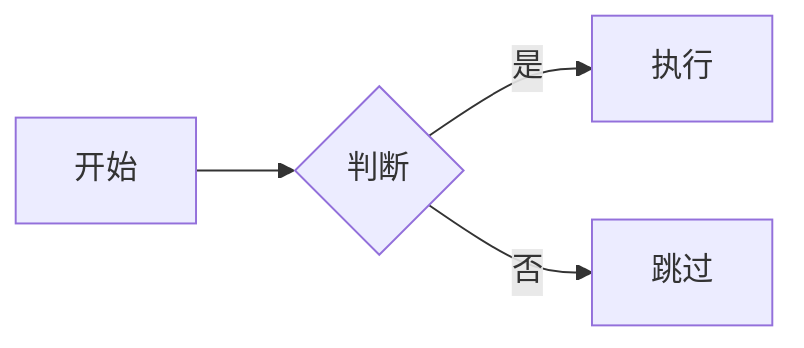

# YiziMarkdown 使用帮助

## 快速上手

YiziMarkdown 是一款简洁精致的跨平台 Markdown 编辑器，支持 Windows 便携版与 macOS 版本。解压即可使用，无需安装。

首次启动会自动打开欢迎文档。点击「新建」开始写作，或按 Ctrl+O 打开已有文件。

---

## 基本操作

### 新建文件

- 按 Ctrl+N 新建空白文件
- 标签栏右侧点击 + 号也可新建

### 打开文件

- 按 Ctrl+O，支持 .md / .markdown / .txt 格式
- 双击 .md 文件（需先在设置中关联）

### 保存文件

- Ctrl+S 保存当前文件
- 新建文件首次保存时会自动弹出「另存为」对话框
- 可开启自动保存，间隔 5~180 秒（默认 60 秒）

### 关闭文件

- 按 Ctrl+W 关闭当前标签
- 点击标签上的关闭按钮
- 未保存的文件关闭时会弹出确认对话框

### 导出

工具栏右侧导出按钮，支持三种格式：
- HTML（保留样式）
- Markdown（纯文本）
- 纯文本（去除所有格式）

---

## 编辑功能

### 视图模式

工具栏右侧或标签栏右侧可切换五种模式：

- **源码**：纯 Markdown 文本编辑
- **并排模式**：左侧编辑，右侧实时预览，支持大纲联动滚动
- **实时模式**：所见即所得（WYSIWYG）编辑，Markdown 标记自动隐藏，专注内容创作，四种原创交互动画，引导注意力聚焦内容
- **预览模式**：纯渲染预览，不可编辑
- **演示模式**：全屏幻灯片播放（`Ctrl+Alt+P`）

切换视图时自动定位到当前编辑位置。

### 实时模式动画

实时模式下，Markdown 标记（如 `#`、`**`、`-` 等）会在光标进入时平滑显现，离开时自动隐藏。提供四种动画效果可选：

| 方案 | 效果 |
|------|------|
| 聚焦（默认） | 文字模糊后重新对焦 |
| 闪光 | 文字闪过一束光 |
| 辉光 | 模糊 + 闪光叠加 |
| 涟漪 | 多波峰衰减，如水面波纹 |

设置路径：设置 → 实时模式，可实时预览各方案效果。

### 工具栏格式化

工具栏提供常用格式按钮，选中文字后点击即可应用：

| 按钮 | 功能 | 快捷键 |
|------|------|--------|
| **粗体** | 加粗选中文字 | Ctrl+B |
| *斜体* | 斜体选中文字 | Ctrl+I |
| ~~删除线~~ | 添加删除线 | Ctrl+- |
| `行内代码` | 包裹为行内代码 | Ctrl++ |
| # 标题 | 在行首添加标题标记 | Ctrl+1/2/3 |
| - 列表 | 在行首添加列表标记 | Ctrl+. / Ctrl+0 |
| > 引用 | 在行首添加引用标记 | Ctrl+' |
| 链接 | 包裹为链接语法 | Ctrl+K |
| 图片 | 包裹为图片语法 | — |
| 代码块 | 插入代码块模板 | Ctrl+` |
| 分割线 | 插入水平分割线 | Ctrl+L |
| Σ 公式 | 选中文字包裹 `$` 行内公式 | — |
| 图表 | 插入 Mermaid 图表代码块 | — |
| 表格 | 打开 8×8 网格，点选插入对应行列数的表格 | Ctrl+T |

选中文字时，粗体、斜体、删除线、行内代码会自动包裹选中内容；标题、列表、引用会在选中行前添加前缀；链接和图片会将选中文字填入显示文本。

表格按钮打开一个 8 行 × 8 列的网格下拉面板，鼠标移到对应位置点击即可插入表格，无需手动输入分隔线和单元格。

选中文字时，粗体、斜体、删除线、行内代码会自动包裹选中内容；标题、列表、引用会在选中行前添加前缀；链接和图片会将选中文字填入显示文本。

### 斜杠菜单

输入 `/` 即可唤出斜杠菜单，快速插入 Markdown 标记（标题、列表、引用、代码块、表格等）。也可通过快捷键 Ins 触发。菜单支持键盘上下选择，按 Enter 插入。

### AI 助手（侧边聊天面板）

工具栏机器人按钮打开右侧 AI 聊天面板，与内置大模型对话：

- **供应商**：内置 18 家大模型 + 自定义服务 = 19 个选项，覆盖 OpenAI、Anthropic、Google Gemini、xAI、Mistral、Groq、DeepSeek、通义千问、智谱 GLM、Kimi、豆包（火山引擎）、硅基流动、MiniMax、小米 MiMo、美团 LongCat、OpenRouter、opencode-go、Ollama 本地模型等，在 设置 → AI 中选择并配置密钥；「自定义服务」可选 OpenAI 兼容 / Anthropic 兼容协议，自填 Base URL、模型 ID 与密钥，本地端点密钥可留空
- **密钥安全**：API 密钥保存在系统钥匙串（OS keychain），设置页可一键保存、清除、验证
- **流式回复**：回答实时流式输出，可随时停止；支持停止生成、清空对话
- **思考过程**：DeepSeek / Qwen / GLM / Anthropic 等推理模型的思考内容以可折叠「思考过程」区块展示（默认收起），不影响正文阅读
- **引用当前文档**：勾选「引用当前文档」后，把当前文档内容作为上下文发送给 AI；可在 设置 → AI 调整引用上限（64K~512K/不限）
- **上下文轮数**：可在设置中配置 0~20 轮历史携带
- **结果落盘**：每条回复下方有 复制、插入到文档（光标处）、创建新文档 三个操作
- **面板状态持久化**：AI 面板的开关与待执行动作会被记住，关闭后再次打开保持状态

#### AI 技能（Skill）

技能用于让 AI 按特定方式完成任务（如把文档提炼为演示文稿）。操作方式：

1. 点击输入框上方的 **⚡ 闪电按钮**，弹出技能菜单（名称 + 一句话简介，鼠标悬停展开详细介绍）
2. 点击选中一个技能，技能会以胶囊标签 **插入输入框光标处**，与输入文字混排
3. 直接输入内容并发送（也可不输入文字直接发送），技能提示词会自动注入 AI 上下文
4. 取消技能：把光标移到标签上退格删除，或悬停标签点击出现的 **❌**
5. 技能标签带 ⚡ 图标的技能（如「演示稿提炼」）会**自动勾选并锁定「引用当前文档」**，删除技能后恢复手动勾选

内置技能：

| 技能 | 说明 |
|------|------|
| 演示稿提炼 | 把当前文档提炼为适合演示模式（幻灯片）的精简 Markdown 文稿 |
| 文档摘要 | 输出一句话主旨 + 核心要点 + 关键结论 |
| 润色改写 | 保持原意，修正语病并优化表达 |
| 全文翻译 | 完整翻译为目标语言，保留专有名词与 Markdown 排版，代码原样保留 |

**技能文件位置（v0.2.3 起）**：技能文件已从程序目录迁移到用户目录 `~/Documents/yizimarkdown/skills/`，方便自定义且**不会被版本更新覆盖**。首次启动新版本时，内置技能会自动同步到该目录。

**自定义技能**：在 `~/Documents/yizimarkdown/skills/` 目录放入技能的 Markdown 提示词文件，并在 `skills.json` 清单中登记（字段：`id`、`name`、`summary`、`description`、`file`、`needsDoc`），重启后在技能菜单中即可看到。示例见内置的 `slides-outline.md`。

**管理技能**：AI 聊天面板底部有「**管理技能**」按钮，一键打开技能目录并查看 `skill-guide.md` 定制指南。

### 多语言界面

支持 15 种界面语言：简体中文（默认）、繁體中文、English、日本語、한국어、Deutsch、Français、Español、Português、Italiano、Polski、Nederlands、Türkçe、Svenska、Українська。

在 设置 → 通用 → 界面语言 切换，即时生效，无需重启。

### 搜索替换

按 Ctrl+F 打开搜索栏：
- 输入关键词高亮匹配
- 点击箭头逐个跳转匹配项
- 输入替换内容后点击「全部替换」

### 大纲导航

侧栏自动生成文档大纲（基于标题层级）：
- 点击大纲标题跳转到对应位置
- 并排模式下大纲与预览双向联动滚动

### 自动补全

编辑器支持 Markdown 语法自动补全：
- 输入 `#` 后按空格，自动生成标题
- 输入 `-` 或 `*` 后按空格，自动生成列表项
- 输入 `>` 后按空格，自动生成引用块
- 输入 `` ` `` 自动配对
- 输入 `**`、`*`、`~~`、`[` 等自动配对关闭

### 标题折叠（v0.2.3 新增）

长文档可以像 Obsidian 一样折叠章节：
- 鼠标悬停标题时，左侧出现折叠图标，点击折叠该标题下的内容
- 已折叠的标题**常显**展开图标，无需 hover
- 快捷键：<kbd>Ctrl</kbd>+<kbd>Shift</kbd>+<kbd>[</kbd> 折叠当前标题，<kbd>Ctrl</kbd>+<kbd>Shift</kbd>+<kbd>]</kbd> 展开

### 划词助手（v0.2.3 新增）

选中一段文字，浮动操作栏立刻出现，可直接交给 AI 处理。可用操作：
- **演示稿**：把选中内容提炼为演示文稿结构
- **摘要**：提炼核心要点
- **改写 / 润色**：优化表达，保持原意
- **翻译**：翻译为目标语言
- **复制**：复制到剪贴板
- **添加到 AI 对话**：作为上下文送进右侧 AI 面板

**与技能联动**：通过划词触发技能时，AI 只处理你选中的文本，输入框里会显示「文本胶囊 + 技能胶囊」，一目了然。

---

## 数学公式

内置 KaTeX 公式插件，支持 LaTeX 公式渲染：

- **行内公式**：在文本中用 `$...$` 包裹，如 `$E=mc^2$`，会渲染为行内数学符号
- **块级公式**：用 `$$...$$` 獬占一行，自动居中渲染为独立公式块

工具栏的 Σ 按钮可快速将选中文字包裹为行内公式。在 设置 → 插件 中可开关 KaTeX 插件。

---

## Mermaid 图表

内置 Mermaid 图表插件，用代码描述即可生成流程图、时序图、甘特图等：


```mermaid
graph LR
    A[开始] --> B{判断}
    B -->|是| C[执行]
    B -->|否| D[跳过]
```

支持的图表类型：流程图（graph/flowchart）、时序图（sequenceDiagram）、甘特图（gantt）、类图（classDiagram）、饼图（pie）、状态图（stateDiagram）等。

工具栏的图表按钮可快速插入 Mermaid 代码块模板。图表主题可在 设置 → 插件 → Mermaid 配置中切换（默认/深色/森林/中性）。

---

## 演示模式（幻灯片）

把任意 Markdown 文档变成**全屏幻灯片**，模拟 PPT 播放。无需导出，直接播放当前文档。**不需要任何额外格式**——按平时写 Markdown 的习惯写，版式自动推断，配色继承当前主题。

### 进入演示模式

- 按 `Ctrl+Alt+P`
- 点击标签栏右侧的「演示」按钮（需处于某个文档中）
- 点击工具栏右侧的「放映」按钮

进入后自动全屏，按 `Esc` 退出并返回编辑界面。鼠标活动时右上角会显示半透明退出按钮，1.5 秒无操作自动隐藏。退出时会自动还原到进入前的窗口状态（全屏/最大化/普通）。

### 分页

用**单独成行的 `---`**（标准 Markdown 水平分割线）翻页：

```markdown
# 第一页

---

# 第二页
```

- `---` 必须单独成行（前后是空行）
- 代码围栏（```` ``` ````）内部的 `---` 是代码内容，**不会**分页
- 文档顶部的 front matter（首个 `--- ... ---` 块）自动忽略，不会成为一页

### 自动版式

引擎分析**整页结构**自动推断版式，无需任何标记，共 14 种：

| 页面结构 | 自动版式 | 效果 |
|----------|---------|------|
| `# 一级标题` + 副标题段落 | 封面页 | 居中大标题 + 渐变下划线 + 作者/日期 meta |
| `##` / `###` 单独成页 | 章节页 | 大号序号 + 居中标题 |
| `# 谢谢/Thanks/Q&A` | 结尾页 | 居中收尾 |
| `## 目录` + 有序列表 | 目录页 | 大号数字双列网格 |
| `## 标题` + 正文 | 内容页 | 标题左上 + 强调下划线，正文左对齐 |
| 标题 + 列表 | 列表页 | 标题左上 + 大号列表 |
| 标题 + 表格 | 数据表页 | 表头主题色 + 斑马纹行 |
| 标题 + 任务列表 | 路线图页 | 大号勾选框 |
| 图片开头 + 文字 | 图文页 | 左图右文双栏 |
| 图片单独成页 | 图片页 | 大图居中 |
| `> 引用` 开头 | 金句页 | 对角大引号 + 居中大字 |
| 代码围栏开头 | 代码页 | 代码聚焦 |
| `mermaid` 围栏开头 | 图表页 | 图表居中 |
| 公式（`$$`）开头 | 公式页 | 公式居中 |

- 显式指令：`<!-- layout: xxx -->` 强制指定版式、`<!-- align: left|center|right -->` 整页对齐（HTML 注释，渲染不可见）
- 装饰层：左下角章节名 + 页码页脚，底部主题色进度条随翻页增长
- 配色继承当前主题与明暗，标题颜色（h1/h2/h3）随主题变化，换主题幻灯片同步换肤
- **鼠标滚轮翻页**：内容可滚动时先滚动内容，滚到上/下边界再翻页；翻页后短暂锁定防惯性连翻

### 演讲者备注（可选）

在幻灯片任意位置用 HTML 注释写备注，播放时按 `S` 显示/隐藏：

```html
<!-- notes: 这一页要强调的重点 -->
```

备注只显示在左下角面板，不会出现在正片画面。

### 播放快捷键

| 按键 | 功能 |
|------|------|
| → / 空格 / PageDown / Enter | 下一页 |
| ← / PageUp / Backspace | 上一页 |
| Home / End | 首页 / 末页 |
| F | 切换全屏 |
| S | 显示 / 隐藏演讲者备注 |
| ? | 显示 / 隐藏帮助 |
| Esc | 退出演示 |

### 支持的内容

幻灯片内支持编辑器全部预览能力：标题、列表、表格、引用、行内 / 块级公式（KaTeX）、Mermaid 图表、本地图片等，与预览模式一致（需在 设置 → 插件 中启用对应插件）。

### 演示模板

程序目录 `templates/` 下的 `Slide-Template.md` 是一个纯 Markdown 的幻灯片示例，涵盖分页、公式、图表等语法。可直接打开后按 `Ctrl+Alt+P` 播放体验，也可作为新幻灯片的起点。

---## 快捷键

| 快捷键 | 功能 |
|--------|------|
| Ctrl+N | 新建文件 |
| Ctrl+O | 打开文件 |
| Ctrl+S | 保存文件 |
| Ctrl+Shift+S | 另存为 |
| Ctrl+W | 关闭标签 |
| Ctrl+H | 导出 HTML |
| Ctrl+M | 导出 Markdown |
| Ctrl+Z | 撤销 |
| Ctrl+Y | 重做 |
| Ctrl+F | 搜索 |
| Ctrl+\ | 切换侧边栏 |
| Ctrl+B | 粗体 |
| Ctrl+I | 斜体 |
| Ctrl+- | 删除线 |
| Ctrl++ | 行内代码 |
| Ctrl+1 | 一级标题 |
| Ctrl+2 | 二级标题 |
| Ctrl+3 | 三级标题 |
| Ctrl+. | 无序列表 |
| Ctrl+0 | 有序列表 |
| Ctrl+' | 引用 |
| Ctrl+K | 链接 |
| Ctrl+` | 代码块 |
| Ctrl+T | 表格 |
| Ctrl+L | 分割线 |
| F1 | 快捷键大全 |
| F2 | 切换深浅模式 |
| F3 | 循环切换视图 |
| Ctrl+Shift+[ | 折叠当前标题 |
| Ctrl+Shift+] | 展开当前标题 |
| Ctrl+Alt+P | 演示模式（幻灯片） |
| Ins | 斜杠菜单 |
| F12 | 开发者工具 |

按 F1 可随时唤出快捷键速查面板，再次按 F1 关闭。所有快捷键均可在 设置 → 快捷键 中自定义，支持可视化配置面板、按键录制和冲突检测。

---

## 多文件管理

### 单实例模式

- 双击 .md 文件或通过文件关联打开时，不会启动多个窗口，自动合并到已有实例
- 重复打开已存在的文件时，自动定位到该标签页

### 标签栏

- 顶部标签栏显示所有打开的文件
- 点击标签切换文件
- 未保存的文件标签上会显示主题色呼吸圆点
- 保存成功后圆点变为勾号，1.5 秒后消失
- 关闭最后一个标签回到首页

### 首页

- 显示最近打开的文件列表
- 包含文件名、大小和修改时间
- 点击文件名可直接打开

---

## 外观定制

打开 设置 > 外观，可自定义编辑器外观。

### 主题

内置十五套主题，每套均支持亮色和深色模式：

| 主题 | 风格 |
|------|------|
| 学术蓝（默认） | 深蓝基调，沉稳专业 |
| 活力橙 | 暖橙基调，鲜明醒目 |
| 科技感 | 冷蓝灰，亮暗双面 |
| 极简风 | 清爽干净的原始风格 |
| 杂志感 | 温暖优雅的阅读体验 |
| 自然风 | 柔和舒适的森林绿调 |
| 液态玻璃 | 冰蓝通透，毛玻璃材质质感 |
| 荔枝红 | 热情红调，温暖鲜明 |
| 紫罗兰 | 雅致文艺，小众高级 |
| 赛博朋克 | 冷白底霓虹青粉，未来感 |
| Facebook | 经典蓝白，简洁社交风 |
| 黑客帝国 | 白底绿字终端风，暗色绿色发光 |
| 薄荷冰沙 | 清透薄荷绿，清凉舒适 |
| 落日熔金 | 暖白底琥珀色，暗色金红落日 |
| 复古打字机 | 老纸底深褐墨色，暗色暖金字 |

在 设置 > 外观 中可切换主题、编辑主题名称、查看色板预览。右上角可快速切换深色 / 亮色模式（快捷键 F2）。

### 自定义主题

在程序目录下的 `themes/` 文件夹放入 `.css` 文件，重启后自动识别并在设置中显示。CSS 文件需使用 `.editor-content` 前缀限定样式范围，避免影响设置面板。

### 深色模式

在 设置 > 外观 中开启「深色模式」开关，即时生效。

### 字体

在 设置 > 编辑器 中可分别设置：
- 源码：字体、字号（12~32px）、行高（1.2~3.0）
- 预览模式：字体、字号（12~32px）、行高（1.2~3.0）

支持搜索系统已安装字体，也可手动输入 CSS font-family。

### 自定义 CSS

在 设置 > 外观 > 自定义 CSS 中编辑样式，或直接编辑程序目录下的 `user.css` 文件。自定义 CSS 加载在所有主题之后，优先级最高。

---

## 通用设置

### 自动保存

- 开启后按设定间隔（5~180 秒，默认 60 秒）自动保存
- 仅在有未保存的修改时触发

### 文件关联

- 在 设置 > 通用 中一键将 YiziMarkdown 设为系统默认 Markdown 编辑器
- 设置后双击 .md 文件即可直接打开
- 可随时取消关联，恢复系统默认

### 文档模板

在程序目录下的 `templates/` 文件夹放入 `.md` 文件，即可作为文档模板。

- **从模板新建**：点击工具栏「新建」右侧的「从模板新建」按钮，在下拉菜单中选择模板，即以该模板的 Markdown 结构创建新文档
- **默认模板**：在 设置 → 通用 → 默认模板 中选择模板后，按 `Ctrl+N` 新建文件时会自动套用该模板的结构
- **模板管理**：在 设置 → 模板 中可新建、编辑、删除模板

> 提示：默认模板直接决定「新建（Ctrl+N）」的文档结构；若未设置，则新建空白文档。

---

## 目录结构

程序目录下的文件说明：

```
YiziMarkdown/
├── YiziMarkdown.exe        # 主程序
├── readme.md               # 项目说明
├── help.md                 # 帮助文档（本文件）
├── welcome.md              # 欢迎文档
├── changelog.md            # 开发日志
├── user.css                # 用户自定义样式
├── keybindings.json        # 快捷键配置
├── md-icon.ico             # Markdown 文件关联图标
├── themes/                 # 主题 CSS 文件
│   ├── academic.css        # 学术蓝（默认）
│   ├── vibrant.css         # 活力橙
│   ├── tech.css            # 科技感
│   ├── minimal.css         # 极简风
│   ├── magazine.css        # 杂志感
│   ├── nature.css          # 自然风
│   ├── liquidglass.css     # 液态玻璃
│   ├── lychee.css          # 荔枝红
│   ├── violet.css          # 紫罗兰
│   ├── cyberpunk.css       # 赛博朋克
│   ├── facebook.css        # Facebook
│   ├── matrix.css          # 黑客帝国
│   ├── mint.css            # 薄荷冰沙
│   ├── sunset.css          # 落日熔金
│   └── typewriter.css      # 复古打字机
├── skills/                 # 旧版技能目录（v0.2.3 起迁移至 ~/Documents/yizimarkdown/skills/）
│   ├── skills.json         # 技能清单（名称/简介/提示词文件名）
│   ├── slides-outline.md   # 演示稿提炼
│   ├── doc-summary.md      # 文档摘要
│   ├── polish-writing.md   # 润色改写
│   └── translate-fulltext.md # 全文翻译
└── templates/              # 文档模板
    └── default.md          # 默认模板
```

> 提示：v0.2.3 起技能文件的真实存储位置是用户目录 `~/Documents/yizimarkdown/skills/`，自定义技能请放这里，避免版本更新时被覆盖。

---

## 常见问题

**Q: 如何切换深色/浅色模式？**
A: 按 F2 快捷键，或在 设置 > 外观 中切换深色模式开关。

**Q: 为什么中文标点输入需要按两次？**
A: 已在 V0.1.2 修复，请升级到最新版本。

**Q: 预览中的图片不显示怎么办？**
A: 本地图片支持 jpg/png/gif/webp/svg/bmp 格式，路径需为绝对路径（如 C:\images\photo.png）。网络图片（http/https 开头）也可正常显示。

**Q: 如何自定义外观？**
A: 三种方式：① 设置面板中选择内置主题；② 在 themes/ 目录放入自定义 CSS 主题文件；③ 编辑 user.css 覆盖任意样式。

**Q: 添加的自定义主题没有出现？**
A: 确保文件放在程序目录下的 themes/ 文件夹中，文件扩展名为 .css，然后重启程序。

**Q: 如何恢复默认设置？**
A: 在各设置面板底部点击「恢复默认」按钮。

**Q: 关联 .md 文件后图标没有变？**
A: Windows 图标缓存可能延迟刷新，可尝试重启资源管理器或重启电脑。

**Q: 数据存储在哪里？**
A: 数据分四个层面存放：

1. **新建/未保存文件**：在编辑器内存在 localStorage 缓存，下次打开软件时自动恢复、自动加载（不依赖系统文件路径，重启后仍在）
2. **配置文件**（主题、自动保存参数、快捷键绑定等）：同样存在 localStorage 缓存中
3. **API 密钥**：保存在系统钥匙串（macOS Keychain / Windows 凭据管理器），**不明文暴露、不上传网络**——随时可在「设置 → AI」清除
4. **技能文件（v0.2.3 起）**：从应用目录迁移至用户目录 `~/Documents/yizimarkdown/skills/`，**支持自定义**，升级软件**不会覆盖**
