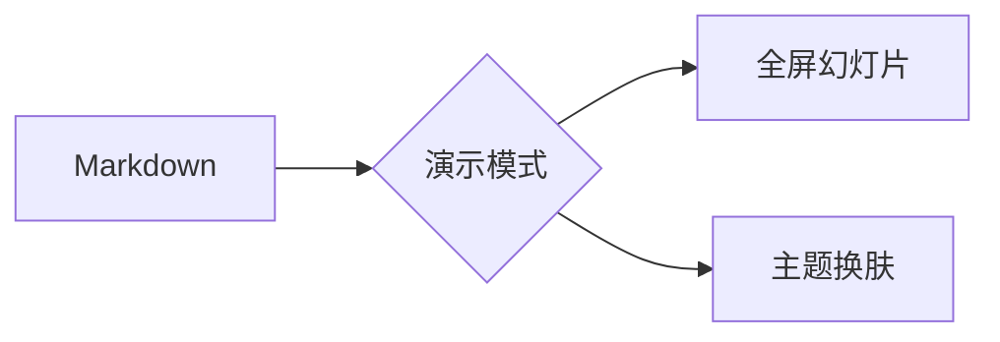

# 封面页测试

这是副标题段落，封面页自动居中大标题 + 渐变下划线
底部会显示 front matter 提供的 作者 · 日期

---

## 目录

1. 封面与章节页
2. 内容页与列表页
3. 数据表与路线图
4. 图文与图片
5. 引用与代码
6. 图表与公式
7. 结尾页

---

## 章节一

---

## 内容页

这是一个内容页示例。标题左上对齐并带主题色下划线，正文左对齐、行宽受控，阅读更舒适。

第二段文字用于演示段落排版效果，多个段落依次排列，垂直节奏稳定。

---

## 列表页

- 一级要点，列表保持左对齐
- 二级要点
- 三级要点

### 子标题

1. 第一步
2. 第二步
3. 第三步

---

## 数据表页

| 功能 | 快捷键 | 说明 |
|------|--------|------|
| 下一页 | → / 空格 | 前进 |
| 上一页 | ← / Backspace | 后退 |
| 全屏 | F | 切换 |
| 帮助 | ? | 浮层 |
| 退出 | Esc | 结束 |

表头使用主题强调色，偶数行斑马纹。

---

## 路线图

- [x] 已完成：整理大纲
- [x] 已完成：撰写初稿
- [ ] 待完成：校对排版
- [ ] 待完成：正式演示

---


图文页自动采用左图右文双栏布局：
图片与文字并排展示，图片自适应高度，
文字列保持左对齐，适合演示产品截图、
架构示意图等带说明的场景。

---


---

> 好的演示，让想法自己说话
> 这是引用页，大引号 + 居中大字

---

```js
const greeting = 'Hello, YiziMarkdown!'
console.log(greeting)
```

---



---

$$
\int_{-\infty}^{+\infty} e^{-x^2} \, dx = \sqrt{\pi}
$$

---

## 显式对齐示例

<!-- align: center -->

这一段通过 HTML 注释指令「align: center」强制整页居中，覆盖内容页默认的左对齐。

---

<!-- layout: quote -->

这一页没有任何引用标记（没有 >），
仅靠 layout: quote 指令就被强制为引用页的大字金句版式，
标题、段落、列表都会被放大居中处理。

---

# 谢谢观看

欢迎随时回来，按 `Esc` 返回编辑
