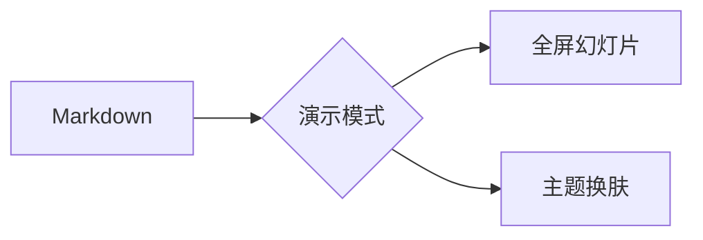

# 演示模式

纯 Markdown，即可成为全屏幻灯片
按 `Ctrl+Alt+P` 或点「演示」按钮开始播放

---

## 目录

1. 分页规则
2. 标题与正文
3. 列表与任务
4. 表格与数据
5. 代码与图表
6. 图文混排
7. 公式与引用

---

## 如何分页

用 `---`（单独成行）分页，它就是标准的水平分割线

```markdown
# 第一页

---

# 第二页
```

代码围栏里的 `---` 是内容，不会分页。

---

## 标题层级

内容页标题默认左上对齐，带主题色下划线：

### 三级标题

这是一段左对齐展示的正文文字，行宽受控，阅读更舒适。

#### 四级标题

较小的标题继续缩小，保持层级清晰。

---

## 无序列表

- 一级要点，列表保持左对齐
- 二级要点
- 三级要点

## 有序列表

1. 第一步
2. 第二步
3. 第三步

---

## 任务清单

- [x] 已完成：整理大纲
- [x] 已完成：撰写初稿
- [ ] 待完成：校对排版
- [ ] 待完成：正式演示

---

## 表格

表格页的表头使用主题强调色，偶数行斑马纹：

| 功能 | 快捷键 |
|------|--------|
| 下一页 | → / 空格 |
| 全屏 | F |
| 帮助 | ? |
| 退出 | Esc |

---

## 行内代码与标签

行内代码 `npm install`、快捷键 `Ctrl+Alt+P`、以及 `code` 标签
都会以强调色「标签」样式展示。

```js
const greeting = 'Hello, YiziMarkdown!'
console.log(greeting)
```

```python
def hello(name):
    print(f"Hello, {name}!")
```

---

## Mermaid图表



需先在 设置 → 插件 中启用 Mermaid 插件

---

## 图文混排


图文页自动采用左图右文双栏布局：
图片与文字并排展示，图片自适应高度，
文字列保持左对齐，适合演示产品截图、
架构示意图等带说明的场景。

---

## 数学公式

行内公式 $E = mc^2$，块级公式居中展示：

$$
\int_{-\infty}^{+\infty} e^{-x^2} \, dx = \sqrt{\pi}
$$

需先在 设置 → 插件 中启用 KaTeX 插件

---

> 好的演示，让想法自己说话

---

# 谢谢观看

欢迎随时回来，按 `Esc` 返回编辑
