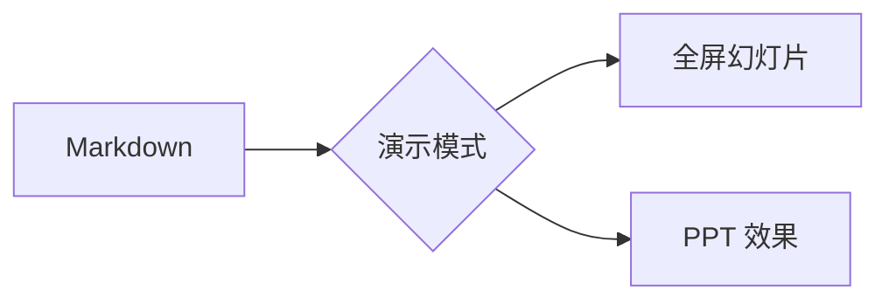

<!-- layout: hero -->

# 演示模式

## 把 Markdown 变成全屏幻灯片

按 `Ctrl+Alt+P` 或点「演示」按钮进入全屏播放

<!-- notes: 开场：大家好，今天演示 YiziMarkdown 的演示模式 -->

---

# 分页规则

- `---` 单独成行 → 横向幻灯片分页
- `--` 单独成行 → 纵向子页（按 ↑↓ 切换）
- 代码围栏里的 `---` 是内容，不会分页

```markdown
---
# 第一页

---

# 第二页
```

---

<!-- bg: linear-gradient(135deg,#667eea,#764ba2) -->
<!-- align: center -->

# 背景指令

在幻灯片顶部用 HTML 注释设置背景：

```html
<!-- bg: #ff9f40 -->
<!-- bg: linear-gradient(135deg,#667eea,#764ba2) -->
<!-- bg: ./images/cover.png -->
```

本页就是一条渐变背景的示例

---

<!-- layout: divider -->

# 进阶内容

分节标题示例（`layout: divider`）

---

# 数学公式

行内公式 $E = mc^2$，块级公式：

$$
\int_{-\infty}^{+\infty} e^{-x^2} \, dx = \sqrt{\pi}
$$

> 需要先在 设置 → 插件 中启用 KaTeX 插件

---

# Mermaid 图表



> 需要先在 设置 → 插件 中启用 Mermaid 插件

---

# 列表与表格

- 要点一
- 要点二
- 要点三

| 功能 | 快捷键 |
|------|--------|
| 下一页 | → / 空格 |
| 全屏 | F |
| 帮助 | ? |
| 退出 | Esc |

---

# 纵向子页示例

本页包含两个纵向子页，按 ↓ 查看第二屏

--

# 纵向子页 2 / 2

这就是 `--` 分隔的纵向子页效果

---

<!-- notes
谢谢观看！
如有任何问题，欢迎交流。
-->

<!-- center -->

# 谢谢观看

用 `Ctrl+Alt+P` 再次体验，或按 `Esc` 返回编辑
